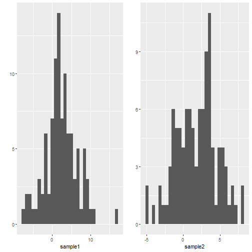
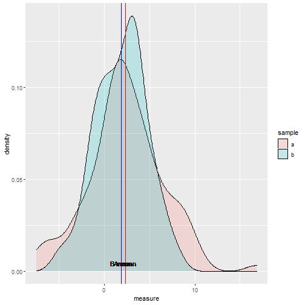

Developing Data Products - Week 4 Assignment
========================================================
author: Chris Payne
date: 13th April 2021
autosize: true

Online Two Sample T Test with plot
========================================================

Have YOU ever wanted a quick online tool where you can just upload your two sample files and 
get back a nice density plot representation and the t.test output?

Then this is the tool for you!

The Problem
========================================================
You have two samples

But how to do a bit of quick analysis and visualization without out all that tedious mucking about in RStudio?
***




The Solution
========================================================


***

```

	Welch Two Sample t-test

data:  measure by sample
t = 0.98485, df = 174.22, p-value = 0.3261
alternative hypothesis: true difference in means is not equal to 0
95 percent confidence interval:
 -0.4902879  1.4669285
sample estimates:
mean in group a mean in group b 
       2.352582        1.864262 
```

Next Steps
========================================================
Save this link in your favourites NOW!!!

https://chris101.shinyapps.io/ddpw4cp/

Check out the code here:
https://github.com/chris-payne101/DDPW4CP/tree/master/ddpw4cp

